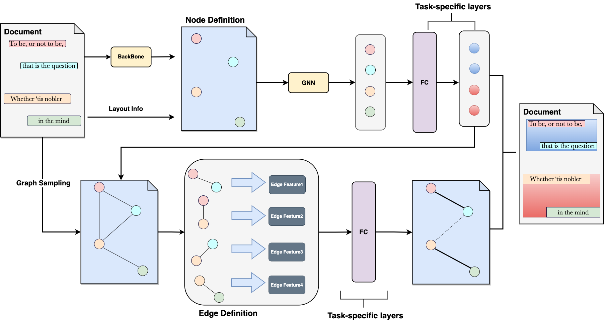

# Paragraph2Graph: A Language-independent GNN-based framework for layout analysis



This is the official code released repo for [_Paragraph2Graph: A Language-independent GNN-based framework for layout analysis_](https://arxiv.org/pdf/2304.11810.pdf)

## Introduction
We propose a language-independent GNN framework for document layout analysis tasks. Our proposed model, Paragraph2Graph, uses a pre-trained CNN to encode image features and incorporates 2d OCR text coordinates and image features as node features in a graph. We use a dynamic graph convolutional neural network (DGCNN) to update the graph based on these features and include edge features based on relationships. With only **19.95 million parameters**, our model is suitable for industrial applications, particularly in **multi-language** scenarios.


## How to Use
### 1. Set up the environment
If you are using ```pytorch==2.0.1```, you can simply set up the environment by 

```json
pip install -r requirements-dev.txt
```

If you are using an older pytorch==1.12.1, make sure to edit ```requirements.txt``` by replacing 
```-r requirements/requirements-dependency-2.0.1.txt``` with ```-r requirements/requirements-dependency-1.12.1.txt```

### 2. Prepare dataset
Let's use the [DocLayNet dataset](https://github.com/DS4SD/DocLayNet) as an example:


1. Please download the DocLayNet core dataset & DocLayNet extra files and merge them into one folder.

Doclaynet core dataset should be like
```
├── COCO
│   ├── test.json
│   ├── train.json
│   └── val.json
├── PNG
│   ├── <hash>.png
│   ├── ...
├── PDF
│   ├── <hash>.pdf
│   ├── ...
├── JSON
│   ├── <hash>.json
│   ├── ...

```
2. Pre-process the dataset with the `scripts/preprocess_data/test_convert_DocLayNet2Graph`
3. After processing, you can find a `DocLayNet_core_graph_labels` folder under your specified output dir
4. Make sure to edit the `config/train_layout_graph_doclaynet.yaml` 
```yaml
datasets:
  train:
    dataset:
      data_root:
        - /your/path/to/DocLayNet_core
      label_root:
        - /your/path/to/DocLayNet_core_graph_labels/train
    collate_fn:
      aug_flag: false
  eval:
    dataset:
      data_root:
        - /your/path/to/DocLayNet_core
      label_root:
        - /your/path/to/DocLayNet_core_graph_labels/val
```
For preprocessing other datasets, you can find scripts under `scripts/preprocess_data/test_convert_Funsd2Graph` and `scripts/preprocess_data/test_convert_Publaynet2Graph` for [FUNSD](https://guillaumejaume.github.io/FUNSD/) and [Publaynet](https://github.com/ibm-aur-nlp/PubLayNet) respectively.

### 3. Start training
You can start the training from ```train/train_experiment.py``` or

```shell
python train/train_experiment.py --config_file config/xxxx.yaml --phase train # you can use your own config file
```
The training script also support ddp with huggingface/accelerate by

```shell
accelerate train/train_experiment.py --config_file config/base.yaml --use_accelerate True
```

### 4. Inference
After training, you can set `phase` to `predict` in `train/train_experiment.py` and specify the path to your trained model in the config file, such as :
```yaml
model:
  model_path: # put the path to your models here

```
### About config files
config file can specify which yaml it wants to override, such as
```yaml
base: config/graph_net/train_layout_graph_doclaynet.yaml
```
Take `config/graph_net/train_layout_graph.yaml` as an example, the hierarchical override line appears as follows:

```
base.yaml

   ⬇️  overrided by
   
graph_net/base.yaml

   ⬇️  overrided by
   
config/graph_net/train_layout_graph.yaml

   ⬇️  overrided by
   
config/graph_net/train_layout_graph_doclaynet.yaml

```


If you find our work helpful, please consider citing our work and leaving us a star.
```
@article{wei2023paragraph2graph,
  title={PARAGRAPH2GRAPH: A GNN-based framework for layout paragraph analysis},
  author={Wei, Shu and Xu, Nuo},
  journal={arXiv preprint arXiv:2304.11810},
  year={2023}
}
```
